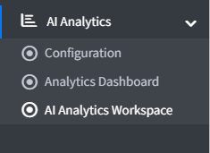

# AI Analytics Workspace

The AI Analytics Workspace is the conversational analytics screen where you can ask business questions in plain English and get instant answers from your live nopCommerce store data.

Access it from **AI Analytics → AI Analytics Workspace** in the admin sidebar.

{ .img-border }

{ .img-border }

---

## Ask Your Store

Type your question in plain English in the input field at the bottom of the page (e.g. *"What was my revenue last month?"*), then click **Ask analytics** or press **Enter**.

The AI confirms details with you if your question is ambiguous, then queries live store data on a **read-only** basis — it can never modify orders, customers, or any other store record. Charts are only generated when you explicitly ask for one; plain questions return a text summary and, where relevant, a data table.

A typical answer includes:

- A short written summary of the finding
- **Key Numbers** — the headline figures behind the answer
- A **Data** table with the underlying rows
- A **Chart** rendering of the data, when requested

Click **Clear chat** to remove the current conversation from view.

---

## Saved Prompts

The **Saved Prompts** panel on the right lists recurring reports and commonly used business questions so your team can re-run them in a single click — for example:

- *Revenue last 30 days* — "What was my total revenue in the last 30 days?"
- *Top selling products* — "Which products had the highest revenue last month?"
- *New vs returning customers* — compares order volume between new and returning customers.

Save any question you ask frequently so it's always one click away.

---

## Recent Prompt Activity

The **Recent Prompt Activity** panel shows a running log of every question asked, with a timestamp and a status:

| **Status**             | **Meaning**                                                                 |
|--------------------------|----------------------------------------------------------------------------------|
| **Success**              | The AI answered the question using store data.                                  |
| **Needs Clarification**  | The question was ambiguous and the AI asked a follow-up before answering.       |

This activity log helps admins and managers track how the workspace is being used and audit past requests.

---

## Example Questions

| **Question**                                    | **What the AI returns**                                           |
|----------------------------------------------------|------------------------------------------------------------------------|
| What was my total revenue this month?               | The total revenue figure for the selected period.                     |
| Which 5 products generated the most revenue?        | A table with product names and revenue values.                        |
| How many people signed up this week?                | The new customer registration count for the period.                   |
| Which payment method do customers prefer?           | A table and/or chart comparing order counts per payment method.       |
| Show revenue by region                              | A table with one row per region showing orders and revenue.           |

> **Note:** The AI only answers questions using approved nopCommerce store data (orders, customers, products, categories, carts, discounts, returns, and addresses). It cannot access external marketing, website traffic, or third-party CRM/ERP data — see [Data Scope](settings.md#data-scope).

---

## Exporting Answers

Use the export controls in the workspace to download an answer as **CSV** or **PDF**, ready to share with finance, operations, or management stakeholders.

[← Previous](dashboard.md) | [Next →](scenarios-of-use.md)
