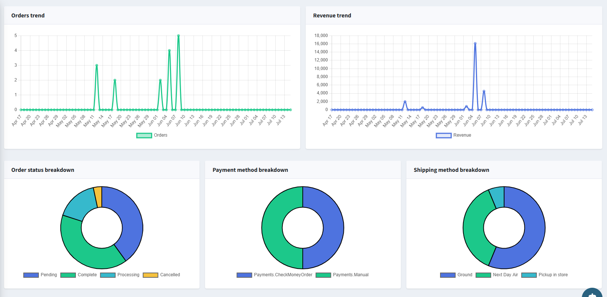
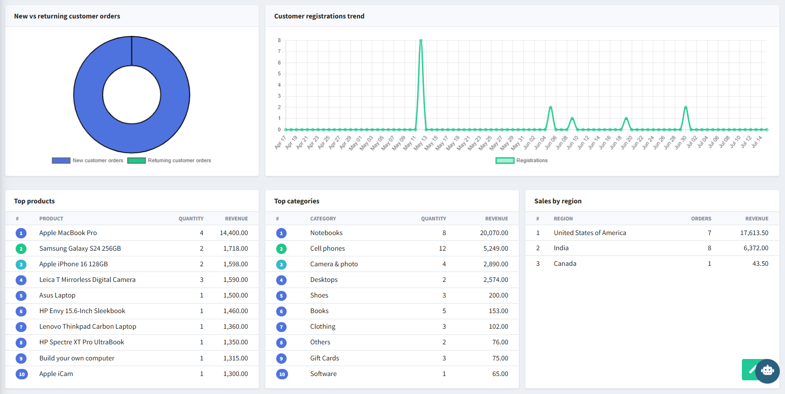

# Analytics Dashboard

The Analytics Dashboard is the main reporting view, accessible from **AI Analytics → Analytics Dashboard** in the admin sidebar.

{ .img-border }

---

## Filter Bar

| **Control**       | **Description**                                                                              |
|---------------------|------------------------------------------------------------------------------------------------|
| **Search**           | Free-text search box to narrow the dashboard view (e.g. by keyword).                          |
| **Quick Range**      | One-click shortcuts: **Last 7 days**, **Last 30 days**, **Last 90 days**.                     |
| **Date from / Date to** | Custom date range for the analytics period.                                                |
| **Search button**    | Applies the selected filters and reloads all cards, charts, and tables.                        |
| **Export**           | Downloads the current dashboard data as a `.xlsx` file.                                        |

---

## Sales Performance

| **Card**                | **Description**                                                                 |
|---------------------------|-------------------------------------------------------------------------------------|
| **Total Revenue**         | Sum of order totals in the selected period.                                        |
| **Total Orders**          | Count of paid and partially refunded orders in the selected period.                |
| **Average Order Value**   | Total Revenue divided by Total Orders.                                             |
| **Avg. Items Per Order**  | Average number of line items per order in the selected period.                     |

## Customers

| **Card**                     | **Description**                                                            |
|---------------------------------|---------------------------------------------------------------------------------|
| **Returning Customer Orders**   | Count of orders placed by customers who have ordered before.                |
| **New Registrations**           | Count of new customer accounts created in the selected period.              |
| **Active Customers**            | Count of unique customers who placed at least one order in the period.      |

## Operations & Health

| **Card**                                | **Description**                                                                 |
|--------------------------------------------|-------------------------------------------------------------------------------------|
| **Pending Orders**                          | Count of orders currently in Pending status.                                       |
| **Cart Items Updated**                      | Count of shopping cart item changes — used as a cart-activity / abandonment signal. |
| **Average Customer Lifetime Value**         | Average total revenue generated per customer.                                      |
| **Customer Retention Rate (90 days)**       | Percentage of customers who made a second purchase within 90 days.                 |
| **Return Requests**                         | Count of return requests submitted in the selected period.                         |
| **Discount Usage**                          | Count of orders where a discount was applied.                                      |

---

## Trend Charts & Breakdowns

{ .img-border }

| **Chart**                     | **Type**    | **Description**                                                              |
|----------------------------------|-------------|------------------------------------------------------------------------------|
| **Orders trend**                 | Line chart  | Number of orders placed per day across the selected date range.             |
| **Revenue trend**                | Line chart  | Daily revenue across the selected date range.                               |
| **Order status breakdown**       | Donut chart | Share of orders by status: Pending, Complete, Processing, Cancelled.        |
| **Payment method breakdown**     | Donut chart | Share of orders by payment method (e.g. Check/Money Order, Manual).         |
| **Shipping method breakdown**    | Donut chart | Share of orders by shipping method (e.g. Ground, Next Day Air, Pickup in store). |

---

## Customers & Top Performers

{ .img-border }

| **Section**                          | **Description**                                                                       |
|-----------------------------------------|-------------------------------------------------------------------------------------------|
| **New vs returning customer orders**    | Donut chart comparing orders from new customers vs. returning customers.              |
| **Customer registrations trend**        | Line chart of new customer registrations per day.                                     |
| **Top products**                        | Ranked table (Rank, Product, Quantity, Revenue) — top 10 products by revenue.          |
| **Top categories**                      | Ranked table (Rank, Category, Quantity, Revenue) — top 10 categories by revenue.       |
| **Sales by region**                     | Ranked table (Rank, Region, Orders, Revenue) — sales grouped by billing/shipping region. |

---

## Excel Export

Clicking **Export** downloads a `.xlsx` file containing the dashboard's KPI summary, daily revenue and orders, and the top products, top categories, and sales-by-region tables for the selected period.

[← Previous](settings.md) | [Next →](ask-ai.md)
