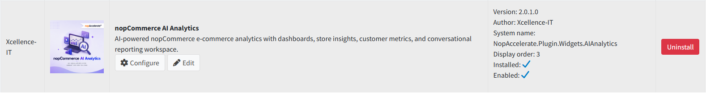

# nopCommerce AI Analytics

The **nopCommerce AI Analytics** plugin brings AI-powered business intelligence directly into your nopCommerce admin panel. It combines a full analytics dashboard with an AI Analytics Workspace where admins can ask business questions in plain English and get instant, data-driven answers — no SQL, no exports, no dashboards to learn.

The plugin uses **live nopCommerce store data only** — orders, order items, customers, products, categories, shopping carts, discounts, returns, and address/region data. No external marketing or third-party data is included.

Once configured, the plugin provides:

- A **visual Analytics Dashboard** covering sales & revenue, orders & checkout, products & catalog, customers & retention, and returns & adjustments
- An **AI Analytics Workspace** where you can query your store data conversationally, with AI-generated summaries, charts, and tables
- **Saved prompts** for recurring reports and commonly used business questions
- A **prompt activity log** to track AI analytics usage and request history
- **Excel export** of dashboard data, plus **CSV/PDF export** of AI analytics output
- Support for **OpenAI, Anthropic, OpenRouter, Azure OpenAI**, and custom AI providers
- **License registration** and license status display, with a dedicated admin permission for secure access

{ .img-border }

| **Plugin Name**     | nopCommerce AI Analytics                                 |
|----------------------|-----------------------------------------------------------|
| **Version**          | 2.0.1.0                                                   |
| **Author**           | Xcellence-IT                                              |
| **Compatible With**  | nopCommerce 4.90                                          |
| **System Name**      | NopAccelerate.Plugin.Widgets.AIAnalytics                  |

> **Data scope:** Analytics uses live nopCommerce store data only (orders, customers, products, carts, discounts, returns, and addresses). External marketing or third-party data is not included. See [Items Not Possible in Initial Scope](scenarios-of-use.md) for details.

[Next →](features.md)
