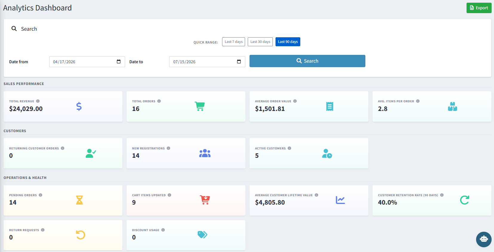
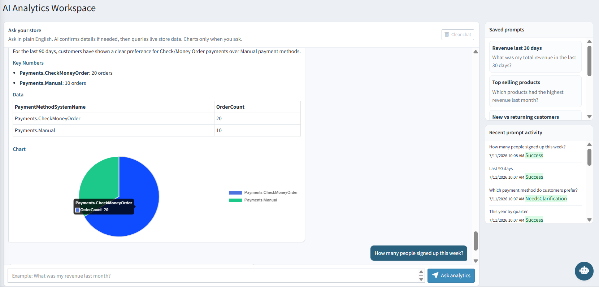

# Scenarios of Use

The following examples show how **nopCommerce AI Analytics** helps store admins make better decisions faster.

---

## Daily Performance Check

A store manager wants a snapshot of how the store is doing. They open the **Analytics Dashboard**, click **Last 7 days**, and instantly see Total Revenue, Total Orders, Average Order Value, and Avg. Items Per Order alongside the Revenue and Orders trend charts.

{ .img-border }

---

## Conversational Data Queries

Instead of building a custom report, an admin opens the **AI Analytics Workspace** and types:

> *"Which payment method do customers prefer?"*

The AI confirms the time period if needed, then responds with the key numbers, a data table, and a chart comparing payment methods — no SQL, no manual export needed.

{ .img-border }

---

## Tracking Customer Retention

A business owner wants to know whether repeat purchases are improving. On the Analytics Dashboard, they review **Customer Retention Rate (90 days)** and **Average Customer Lifetime Value** in the Operations & Health section, and use **New vs returning customer orders** to see the split between first-time and repeat buyers.

---

## Reusing Recurring Reports

An operations manager checks revenue every Monday morning. Instead of retyping the same question, they save it as **"Revenue last 30 days"** in the AI Analytics Workspace's **Saved Prompts** panel and re-run it with a single click each week.

---

## Reviewing Regional & Category Performance

A merchandising team wants to know which regions and categories are driving sales this quarter. They use the **Sales by region** and **Top categories** tables on the dashboard to compare quantity and revenue side by side.

---

## Exporting for Reporting

A store owner needs to share monthly performance data with their accountant. They set the date range to the previous month on the Analytics Dashboard and click **Export** to download an `.xlsx` file, or ask the AI Analytics Workspace for the same report and export the answer as **PDF**.

---

## Auditing AI Analytics Usage

A store admin wants to confirm what questions the team has been asking. They open the AI Analytics Workspace and review the **Recent Prompt Activity** panel, which lists each question with its timestamp and status (**Success** or **Needs Clarification**).

---

## What's Out of Scope

The plugin reports only on data available inside nopCommerce. It does **not** report on external marketing platforms (Google Ads, Meta Ads, social campaigns), website traffic/visitor analytics, email campaign performance, cross-channel attribution, or data from external CRM, POS, or ERP systems — unless that data is otherwise stored inside nopCommerce.

---

> If the AI Analytics Workspace is not responding, check your **AI provider** and **AI API key** in [Configuration](settings.md) and confirm the model name is correct.

[← Previous](ask-ai.md) | [Next →](help.md)
