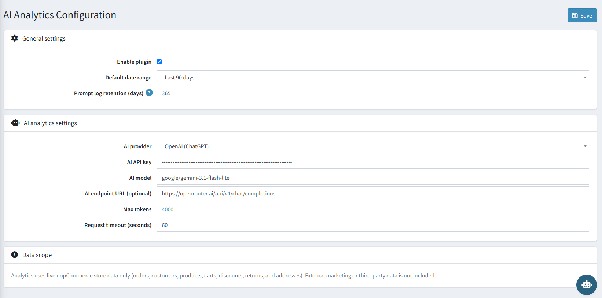

# Configuration

The Configuration screen is accessible from **AI Analytics → Configuration** in the admin sidebar, or via **Configure** on the Local Plugins page. All plugin setup, licensing, and AI provider settings are managed here.

{ .img-border }

---

## License & Activation

| **Setting**            | **Description**                                                                 |
|-------------------------|-----------------------------------------------------------------------------------|
| **License Key**         | Enter the license key received on your registered email after purchase.        |
| **License Status**      | Displays the current activation status of the plugin.                           |

> A dedicated admin permission controls who can view and edit this screen, keeping license and API key details restricted to authorized staff.

---

## General Settings

| **Setting**                      | **Description**                                                                                       |
|-----------------------------------|----------------------------------------------------------------------------------------------------------|
| **Enable plugin**                 | Enables or disables the entire nopCommerce AI Analytics plugin. Uncheck to hide it from the admin sidebar without uninstalling it. |
| **Default date range**            | The date range pre-selected when the Analytics Dashboard first loads (e.g. Last 90 days).             |
| **Prompt log retention (days)**   | Number of days AI Analytics Workspace prompt logs are kept before automatic cleanup. Default: 365.    |

---

## AI Analytics Settings

| **Setting**                        | **Description**                                                                                                    |
|--------------------------------------|-------------------------------------------------------------------------------------------------------------------|
| **AI provider**                     | Select your AI service provider. Options: OpenAI (ChatGPT), Anthropic (Claude), OpenRouter (Multi-model), Azure OpenAI, Custom / Self-hosted. |
| **AI API key**                      | Your secret API key from the selected provider. Leave blank to keep the existing saved key.                       |
| **AI model**                        | The model identifier to use. Example: `google/gemini-3.1-flash-lite`.                                              |
| **AI endpoint URL (optional)**      | Required only for **Azure OpenAI** or **Custom / Self-hosted** models. Example: `https://openrouter.ai/api/v1/chat/completions`. Leave blank for all other providers — endpoints are resolved automatically. |
| **Max tokens**                      | Maximum number of tokens the AI may return per response. Default: 4000.                                            |
| **Request timeout (seconds)**       | HTTP timeout for AI provider calls in seconds. Default: 60.                                                        |

### Provider Quick Reference

| **Provider**    | **Example Models**                                                                 | **Notes**                              |
|-----------------|--------------------------------------------------------------------------------------|------------------------------------------|
| OpenAI (ChatGPT)| `gpt-4o`, `gpt-4o-mini`, `gpt-4-turbo`                                              | Standard OpenAI API key                  |
| Anthropic       | `claude-sonnet-4-6`, `claude-opus-4-6`                                              | Anthropic API key                        |
| OpenRouter      | `google/gemini-3.1-flash-lite`, `meta-llama/llama-3.3-70b-instruct`, `mistralai/mistral-7b-instruct` | API key starts with `sk-or-v1-`          |
| Azure OpenAI    | Your deployment name                                                                 | Requires AI endpoint URL                 |
| Custom          | Any OpenAI-compatible model                                                          | Requires AI endpoint URL                 |

### How to Get Your API Key (OpenRouter)

1. Go to [https://openrouter.ai](https://openrouter.ai) and create a free account.
2. Navigate to **API Keys** in your account settings.
3. Generate a new key — it will start with `sk-or-v1-`.
4. Paste it into the **AI API key** field and set **AI provider** to **OpenRouter (Multi-model)**.

---

## Data Scope

> **Analytics uses live nopCommerce store data only** (orders, customers, products, carts, discounts, returns, and addresses). External marketing or third-party data is not included.

This is a fixed platform boundary, not a toggle: the plugin only ever reads standard nopCommerce entities (Orders, Order Items, Customers, Products, Categories, Shopping Carts, Discounts, Returns, and Address/Region data). It never connects to external marketing platforms, website analytics tools, email campaign systems, CRMs, POS, or ERP systems.

---

## Saving Settings

Click the **Save** button in the top-right corner of the page. A success notification will confirm the settings were saved.

[← Previous](licence.md) | [Next →](dashboard.md)
